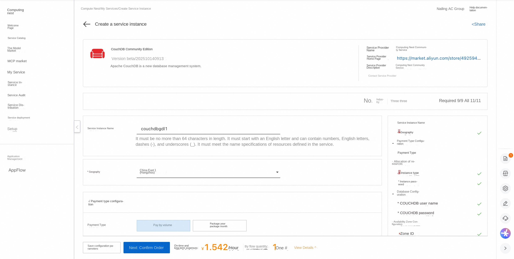
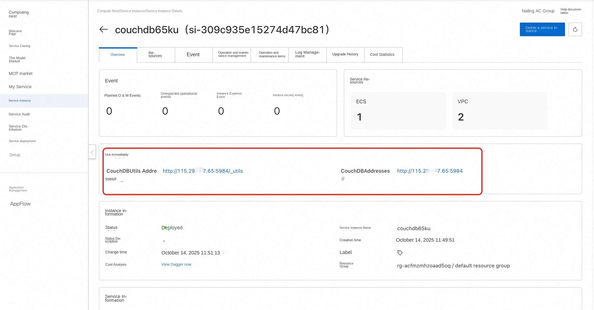
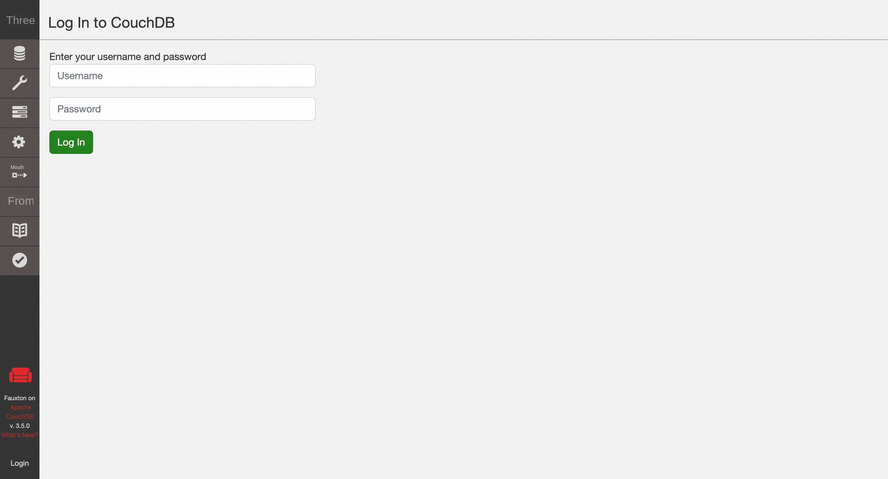

##🌟Service Introduction

The CouchDB is a database that completely contains the web. Store data in JSON documents. CouchDB work well with modern web and mobile applications. CouchDB comes with a set of features, such as dynamic document conversion and real-time change notifications, which makes web development a breeze. It even comes with an easy-to-use web management console that provides services directly from the CouchDB! CouchDB have a fault-tolerant storage engine that puts the security of your data first.

##🚀Deployment Process

1. Visit the Computing Nest CouchDB Community Edition [Deployment Link](https://computenest.console.aliyun.com/service/instance/create/cn-hangzhou?type=user&ServiceId=service-b2eb70f52d2444129d29) and fill in the deployment parameters as prompted:

2. After completing the parameters, you can see the corresponding RFQ details. After confirming the parameters, click **Next: Confirm Order**.

3. Confirm that the order is complete and agree to the service agreement and click **Create Now** to enter the deployment phase.

4. Wait for the deployment to complete and enter the service instance details page.

5. Click on the service address and use the CouchDB Community Edition.

#📚Guidelines for use

For more usage, please refer to the CouchDB [official website document](https://www.osgeo.cn/couchdb-documentation/intro/index.html).