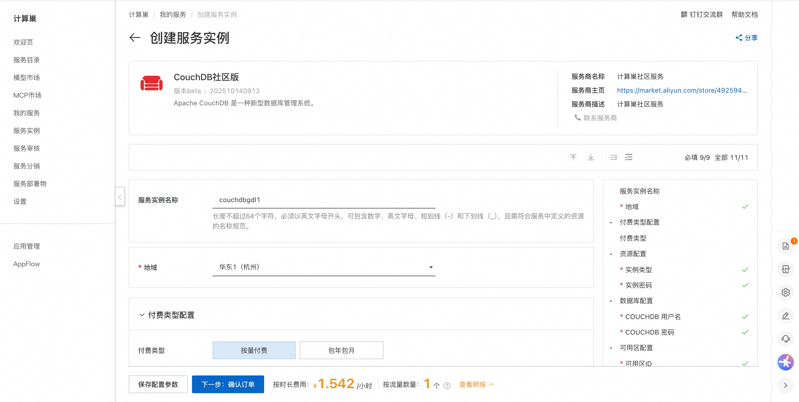
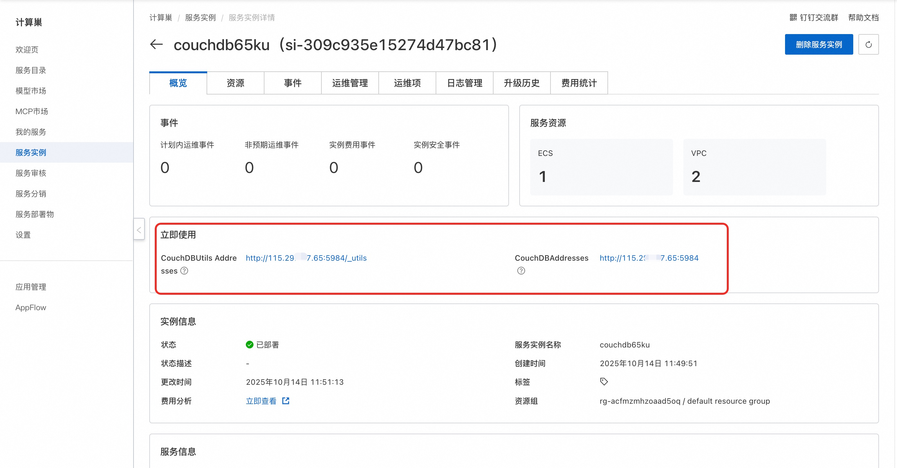
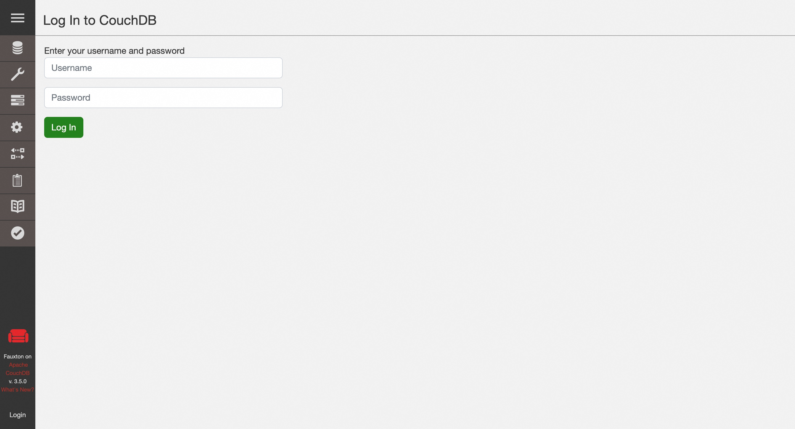

## 🌟 服务简介

CouchDB是一个完全包含web的数据库。用JSON文档存储数据。CouchDB可以很好地与现代web和移动应用程序配合使用。 CouchDB附带了一套特性，例如动态文档转换和实时性 change notifications ，这使得web开发变得轻而易举。它甚至还附带了一个易于使用的web管理控制台，直接从CouchDB提供服务！CouchDB有一个容错存储引擎，它将数据的安全放在第一位。

## 🚀 部署流程

1. 访问计算巢CouchDB社区版[部署链接](https://computenest.console.aliyun.com/service/instance/create/cn-hangzhou?type=user&ServiceId=service-b2eb70f52d2444129d29)，按提示填写部署参数：
   

2. 参数填写完成后可以看到对应询价明细，确认参数后点击**下一步：确认订单**。

3. 确认订单完成后同意服务协议并点击**立即创建**进入部署阶段。

4. 等待部署完成后进入服务实例详情页。
   

5. 点击服务地址并使用CouchDB社区版。
   

# 📚 使用指南

更多用法请参考CouchDB[官网文档](https://www.osgeo.cn/couchdb-documentation/intro/index.html)。